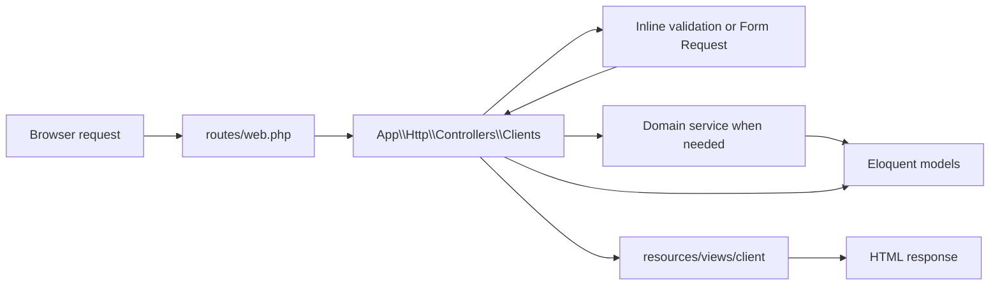

# Car Showroom Application Architecture

> Audience: developers and coding agents working in this repository.
>
> This document defines the agreed application structure. Read it together with
> [`AGENTS.md`](../AGENTS.md) and [`docs/coding-standards.md`](coding-standards.md)
> before implementing a feature.

## 1. Architectural decision

The application intentionally uses two presentation patterns:

| Area | Default presentation pattern | Reason |
|---|---|---|
| Client/public website | Laravel controller + Blade | Public pages are primarily request/response pages, SEO-friendly, and do not need persistent UI state for most interactions. |
| Admin application | Full-page Livewire + Livewire Blade views | Admin workflows need dynamic filters, pagination, inline validation, repeated CRUD actions, and minimal full-page reloads. |

These rules are the default for new work:

- A new client-facing page **MUST** enter through a controller unless there is a documented reason to use a different pattern.
- A new interactive admin page **MUST** use Livewire.
- Do not create both a controller-rendered admin view and a Livewire view for the same screen.
- Livewire still renders Blade. "Admin uses Livewire" means:
  - component class: `src/app/Livewire/Admin/...`
  - component view: `src/resources/views/livewire/admin/...`
- Business rules do not belong to either presentation pattern. Non-trivial rules and multi-table writes belong in `src/app/Services`.

## 2. High-level request flows

### 2.1 Client/public flow



Typical read flow:

```text
GET request
  -> routes/web.php
  -> client controller
  -> Eloquent query / read service
  -> client Blade view
  -> HTML response
```

Typical write flow:

```text
POST/PATCH request
  -> routes/web.php
  -> inline validation or Form Request when the input is complex/reused
  -> thin client controller
  -> service for business rules or multi-step writes
  -> redirect / response
```

### 2.2 Admin flow

```mermaid
flowchart LR
    Browser[Admin browser] --> GetRoute[GET route in routes/admin.php]
    GetRoute --> Page[Full-page Livewire component]
    Page --> LivewireBlade[resources/views/livewire/admin]
    LivewireBlade --> Action[Livewire action/filter/pagination]
    Action --> Authorization[Persistent admin middleware + component permission]
    Authorization --> Validation[Component validation]
    Validation --> Service[Service for non-trivial writes]
    Validation --> Model[Eloquent for simple single-table operations]
    Service --> Model
    Model --> Rerender[Livewire re-render]
    Rerender --> LivewireBlade
```



Initial admin page load is still a normal GET request. Subsequent UI interactions
are handled by Livewire and normally do not reload the full page.

Typical admin interaction:

```text
wire:click / wire:submit / wire:model
  -> Livewire update endpoint
  -> persistent auth and permission middleware
  -> component action
  -> validation
  -> service or Eloquent
  -> component re-render
```

## 3. Directory map

```text
car-showroom/
├── AGENTS.md
├── docs/
│   ├── application-architecture.md
│   └── coding-standards.md
└── src/
    ├── app/
    │   ├── Http/
    │   │   ├── Controllers/
    │   │   │   ├── Clients/          # Client request entry points
    │   │   │   └── Admin/            # Legacy admin pages + HTTP-only endpoints
    │   │   ├── Middleware/            # Authentication and permission boundaries
    │   │   └── Requests/              # Complex/reused validation for controller flows
    │   ├── Livewire/
    │   │   └── Admin/                 # Preferred admin presentation layer
    │   ├── Models/                    # Eloquent entities and relationships
    │   ├── Services/                  # Business rules and transaction boundaries
    │   └── Support/                   # Focused shared infrastructure
    ├── resources/views/
    │   ├── client/                    # Client Blade pages, layouts, and partials
    │   ├── livewire/admin/            # Blade views paired with admin Livewire classes
    │   └── admin/                     # Shared admin shell + legacy pages awaiting migration
    ├── routes/
    │   ├── web.php                    # Client/public routes
    │   └── admin.php                  # Admin routes
    └── public/boxcar/                  # Existing BoxCar assets and admin CSS
```

Application commands are run from `src/`.

## 4. Layer responsibilities

| Layer | Owns | Must not own |
|---|---|---|
| Routes | URL, HTTP method, route name, middleware, route binding | Business rules, database writes, large closures |
| Client controllers | Request orchestration and response shaping | Complex business logic or reusable validation |
| Form Requests | Complex/reused validation, normalization, and request authorization for controller flows | Database workflow orchestration |
| Livewire components | Admin UI state, filters, pagination, validation, events, calling services | Large domain workflows or unrelated reusable helpers |
| Services | Business rules, multi-step writes, transactions, side effects | HTML rendering or Livewire UI state |
| Models | Relationships, casts, query scopes, entity-level behavior | Page orchestration |
| Blade views | Rendering and small presentation-only decisions | Queries, writes, permission decisions, business logic |

## 5. Client implementation conventions

Client code stays under these locations:

```text
src/app/Http/Controllers/Clients/
src/app/Http/Requests/Clients/       # when request validation is needed
src/resources/views/client/
src/resources/views/client/layouts/
src/resources/views/client/partials/
```

Rules:

1. Keep controllers thin.
2. Validate a small one-off payload directly in the controller. Use a Form Request when validation is non-trivial, reused, needs normalization, has cross-field rules, or owns request authorization.
3. Use eager loading intentionally to avoid N+1 queries.
4. Pass explicit data to Blade; do not query the database from Blade.
5. Reuse client partials before creating new markup.
6. Preserve the BoxCar layout and assets.
7. Use a service when a request has business rules, multiple writes, a transaction, or reusable behavior.

Example client route and controller:

```php
Route::get('/inventory', [InventoryController::class, 'index'])
    ->name('inventory.index');
```

```php
final class InventoryController extends ClientBaseController
{
    public function index(Request $request): View
    {
        return $this->clientView('client.inventory', [
            'cars' => CarUnit::query()
                ->with(['trim.model.make', 'media'])
                ->published()
                ->paginate(12),
        ]);
    }
}
```

## 6. Admin Livewire conventions

### 6.1 Component and view pairing

Every full-page admin component must have a matching Livewire Blade view.

```text
src/app/Livewire/Admin/Leads/Index.php
src/resources/views/livewire/admin/leads/index.blade.php
```

Use these naming patterns:

| Screen type | Preferred class name | Preferred view name |
|---|---|---|
| Module root / List page | `Index.php` | `index.blade.php` |
| Detail page | `Show.php` | `show.blade.php` |
| Create/edit page | `Form.php` | `form.blade.php` |
| CRUD panel nested in a workspace | `Manager.php` | `manager.blade.php` |

Catalog is a deliberate composite workspace:

```text
Catalog/Index.php
├── Makes/Manager.php
├── Models/Manager.php
└── Trims/Manager.php

Trims/Form.php                  # Full create/edit form for detailed trim metadata
```

Do not add controller-rendered duplicates under `resources/views/admin/catalog`.

### 6.2 Full-page layout

Full-page admin components render through `admin.layouts.livewire`:

```php
public function render(): View
{
    return view('livewire.admin.example.page', [
        'rows' => Example::query()->paginate(15),
    ])->layout('admin.layouts.livewire', $this->adminLayoutData([
        'adminPageTitle' => 'Example',
        'adminPageDescription' => 'Manage examples.',
    ]));
}
```

Use `admin.layouts.app` only for legacy controller-rendered admin pages that have
not yet been migrated. Do not use it for a new interactive admin module.

### 6.3 Authorization

Admin authorization is intentionally enforced at more than one boundary:

1. `routes/admin.php` uses `auth` and `admin.access`.
2. Each route group uses `admin.permission:<permission>`.
3. Livewire persistent middleware is registered in `AppServiceProvider` so
   subsequent Livewire update requests keep the same protection.
4. Admin components extend `AdminPageComponent` and declare their permission.

```php
final class Page extends AdminPageComponent
{
    protected function requiredPermission(): ?string
    {
        return 'settings.manage';
    }
}
```

Do not extend `Livewire\Component` directly for an admin page unless there is a
documented architectural reason.

Use `#[Locked]` for public identifiers that must not be changed by the browser:

```php
#[Locked]
public int $leadId;
```

Never trust an ID, status, or role value merely because the UI only exposes valid
options. Validate every value again in the Livewire action.

### 6.4 UI state and URLs

- Use `#[Url]` for filters, search terms, tabs, sort order, and view mode when a
  page should be bookmarkable or survive refresh/navigation.
- Reset pagination whenever a filter or page-size property changes.
- Use `WithPagination`; do not load an unbounded table into a component.
- Use `wire:key` for repeated rows, cards, and editors.
- Use `wire:loading` and disable submitting controls while an action is running.
- Use `wire:navigate` between compatible Livewire admin pages.
- Prefer Livewire events and server-rendered state over custom JavaScript for core CRUD behavior.

### 6.5 Validation

Controller-based flows may validate a small one-off payload with
`$request->validate()`. Use a Form Request only when rules are non-trivial,
reused, require input normalization, contain cross-field checks, or own request
authorization. Do not create a separate Request class for every endpoint by
default.

Livewire actions validate inside the component because there is no normal
POST/PATCH controller endpoint.

Recommended component shape:

```php
/** @var array<string, mixed> */
public array $form = [];

public function save(ExampleManagementService $service): void
{
    $this->form = $this->normalizeForm($this->form);
    $validated = $this->validate($this->rules());

    $service->save($validated['form']);
}
```

Rules:

- Normalize whitespace, nullable values, booleans, and slugs before validation.
- Use explicit validation allow-lists for statuses and workflow values.
- Validate relationship IDs; restrict them to the intended role or entity set when necessary.
- Keep rules local when only one component uses them.
- Extract validation only when it is genuinely shared.

### 6.6 Service boundary

A Livewire component may update a model directly only for a simple single-table
operation with no domain workflow. Examples include moderating one review status
or adding one lead note.

Use a service when any of the following is true:

- more than one table is written;
- transaction boundaries are required;
- the operation changes workflow state;
- the same behavior is called from multiple entry points;
- failure must roll back related changes;
- significant business rules determine whether the write is allowed.

Do not introduce Repository, DTO, Action, Presenter, or generic helper layers
unless the touched module already uses that pattern or the project owner requests it.

## 7. Current admin migration status

The target architecture is Livewire for the admin application, but migration is
incremental. Do not copy a legacy implementation when building new functionality.

| Admin module | Current implementation | Direction |
|---|---|---|
| Authentication | Controller | Intentional HTTP/session boundary; keep controller-based unless explicitly redesigned. |
| Catalog: Makes, Models, Trims | Livewire | Current reference implementation. |
| Leads | Livewire | Current reference for list/detail/filter/note workflows. |
| Review moderation | Livewire | Keep Livewire. |
| Settings | Livewire + service | Keep Livewire and preserve `ShowroomSettingsService`. |
| Appointments | Livewire + service | Migrated to Livewire (Phase 1); preserve AppointmentManagementService. |
| Inventory | Livewire + workflow service | Migrated to Livewire (Phase 4); preserve InventoryWorkflowService. |
| Sales | Livewire + service | Migrated to Livewire (Phase 2); preserve SaleManagementService. |
| Dashboard | Livewire | Migrated to Livewire (Phase 3). |

When a module is migrated, update this table in the same change.

## 8. Route conventions

Client routes belong in `src/routes/web.php`. Admin routes belong in
`src/routes/admin.php`.

Admin full-page Livewire route:

```php
Route::get('/leads', LeadsIndex::class)->name('leads.index');
Route::get('/leads/{lead}', LeadShow::class)->name('leads.show');
```

Livewire actions such as `save`, `updateStatus`, or `addNote` do not need custom
POST/PATCH routes. Preserve stable GET route names where possible because other
modules may link to them.

Controllers remain appropriate for genuinely HTTP-specific endpoints, including:

- login/logout and session boundaries;
- external callbacks or webhooks;
- download/stream responses;
- endpoints whose response is not an admin UI state transition.

## 9. UI conventions

Before creating or restyling UI, search in this order:

1. Existing project views and partials.
2. Existing assets under `src/public/boxcar`.
3. BoxCar template source at `C:\Users\minhd\Desktop\tailieuCars\cars dealer`.

Admin rules:

- Preserve the current admin shell.
- Reuse `c1-*`, `admin-*`, existing table, toolbar, form, modal, alert, and pagination patterns.
- Use `asset('boxcar/...')` for BoxCar assets.
- Do not add React, Vue, Alpine, a Tailwind-first rewrite, or another component library without explicit approval.
- Do not copy entire template pages; port only the required section.

Client rules:

- Preserve layouts under `resources/views/client/layouts`.
- Reuse partials under `resources/views/client/partials`.
- Keep client HTML aligned with the BoxCar public theme.

## 10. Decision guide

| Change requested | Correct starting point |
|---|---|
| New public page | Client controller + client Blade view |
| Small one-off public form | Client controller + inline `$request->validate()` |
| Complex or reused public form | Client controller + Form Request; service if workflow is non-trivial |
| New admin CRUD page | Full-page Livewire component + Livewire Blade view |
| Admin filter, tab, search, pagination | Livewire state, normally with `#[Url]` |
| Admin create/edit form | Livewire action and component validation |
| Simple one-row admin update | Livewire component may use Eloquent directly |
| Multi-table or workflow update | Livewire component calls a service with a transaction |
| Shared domain behavior | Service or focused domain class, not a controller/component helper |
| HTTP-only response or callback | Controller |

## 11. Migration procedure for a legacy admin module

Use this order when converting an existing controller + Blade module:

1. Inventory the routes, controller actions, Form Requests, views, services, and inbound route references.
2. Create the full-page component under `app/Livewire/Admin/<Module>`.
3. Extend `AdminPageComponent` and declare `requiredPermission()`.
4. Move filters, pagination, form state, and validation into the component.
5. Keep existing business services and transaction boundaries.
6. Move the Blade UI under `resources/views/livewire/admin/<module>`.
7. Replace form submissions and filter GET forms with Livewire bindings/actions.
8. Point GET routes to the Livewire page and preserve route names where practical.
9. Search for references to old POST/PATCH route names.
10. Remove obsolete controller actions, Form Requests, views, and empty directories only after references are gone.
11. Update the migration status table in this document.
12. Run the required verification commands.

## 12. Anti-patterns

Do not:

- create parallel `resources/views/admin/<module>` and
  `resources/views/livewire/admin/<module>` implementations for one screen;
- add a new interactive admin CRUD flow through controller + Blade;
- put database writes or business logic in route files;
- query Eloquent from Blade;
- duplicate a business rule in a controller, Livewire component, and service;
- bypass `AdminPageComponent` or omit `requiredPermission()`;
- expose mutable record IDs without `#[Locked]` or revalidation;
- replace service-backed transactions with several direct model writes in a component;
- use custom JavaScript for behavior Livewire already provides;
- add an abstraction layer solely for architectural appearance;
- keep unused routes, controller actions, service methods, request classes, eager loads, or imports without a documented external consumer;
- reorganize unrelated modules during a focused migration.

## 13. Completion checklist

Before considering an implementation complete, confirm:

- [ ] The code uses the correct client or admin presentation pattern.
- [ ] Route files remain thin.
- [ ] The component/controller has the correct authorization boundary.
- [ ] All browser-controlled values are validated.
- [ ] Multi-table writes run through a service transaction.
- [ ] Relationships are eager loaded where needed.
- [ ] Pagination and filters do not cause N+1 or unbounded queries.
- [ ] The Blade file lives in the correct view tree.
- [ ] No duplicate legacy implementation remains.
- [ ] Existing BoxCar/admin UI patterns were reused.
- [ ] No unused route, method, request class, eager load, or import remains in the touched flow.
- [ ] `composer lint` was run from `src/`.
- [ ] `composer stan` was run for non-trivial PHP/query/validation changes.
- [ ] Any check that could not run is reported clearly.

Current project-owner testing preference:

- Do not add new automated tests unless the project owner explicitly requests them.
- Do not delete, weaken, or rewrite existing tests merely to avoid failures.
- When tests are explicitly requested, run them from `src/` with `composer test`.

## 14. Sources of truth

When instructions appear to conflict, follow this order:

1. The project owner's explicit request for the current task.
2. Repository instructions in `AGENTS.md`.
3. This architecture document.
4. `docs/coding-standards.md`, `src/pint.json`, and `src/.editorconfig`.
5. Existing implementation patterns in the module being changed.

If an existing legacy module conflicts with the target architecture, treat it as
migration context, not as the template for new admin code.
